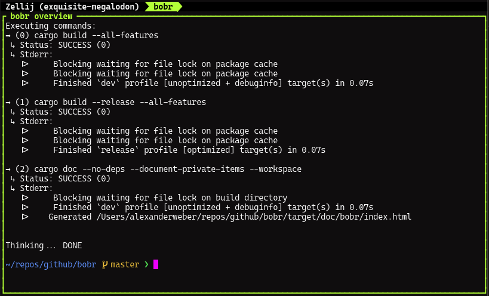

# bobr

`bobr` is a simple command multiplexer, particularly useful for executing multiple commands in parallel. It supports both short-lived task execution and long-lived process management, such as running a backend and frontend simultaneously and managing their lifecycle together.

## How to use

`bobr` executes all specified commands as child processes in parallel.

- `bobr -c "sleep 5" -c "sleep 10" -c "sleep 2 && exit 1"`
  Execute multiple commands in parallel as specified via the command line.
- `bobr -c "sleep 5" -f ./tasks.sh`
  Commands can also be loaded from a file for convenience.
- `bobr -e --stdout=json -f ./tasks.sh`
  This command propagates the stdout pipe from child tasks into the `bobr` stdout pipe, allowing output in JSON format.
