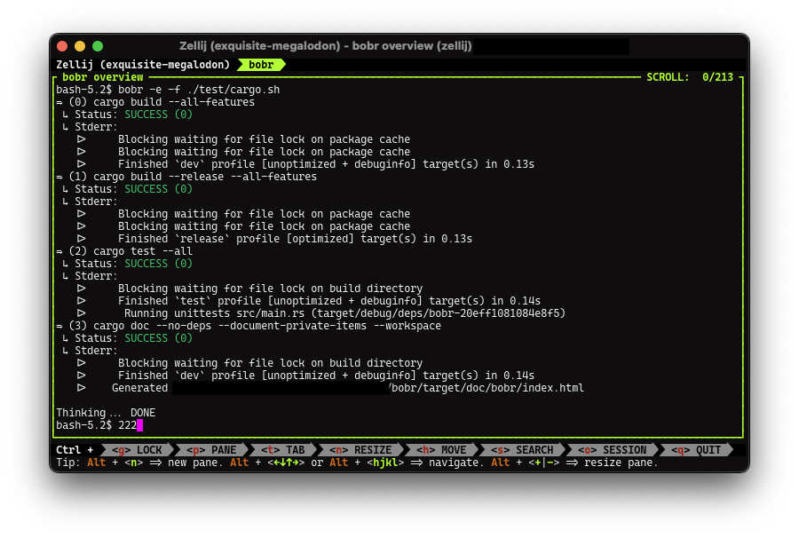

# bobr

`bobr` is a simple command multiplexer. Especially useful for executing multiple commands in parallel, whether that is short lived task execution or long lived process spawning such as spinning up a backend and frontend at the same time and tearing it down together, too.

## How to use

`bobr` will execute all given commands as child processes in parallel.

- `bobr -c "sleep 5" -c "sleep 10" -c "sleep 2 && exit 1"` \
  Execute multiple commands parallel given via command line.
- `bobr -c "sleep 5" -f ./tasks.sh` \
  Commands can also be loaded from a file.
- `bobr -e --stdout=json -f ./tasks.sh` \
  This command propagates the stdout pipe from child tasks into the `bobr` stdout pipe.
